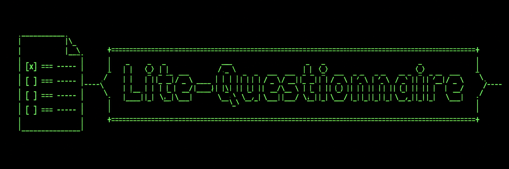
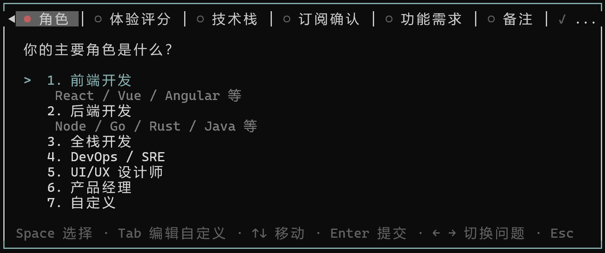
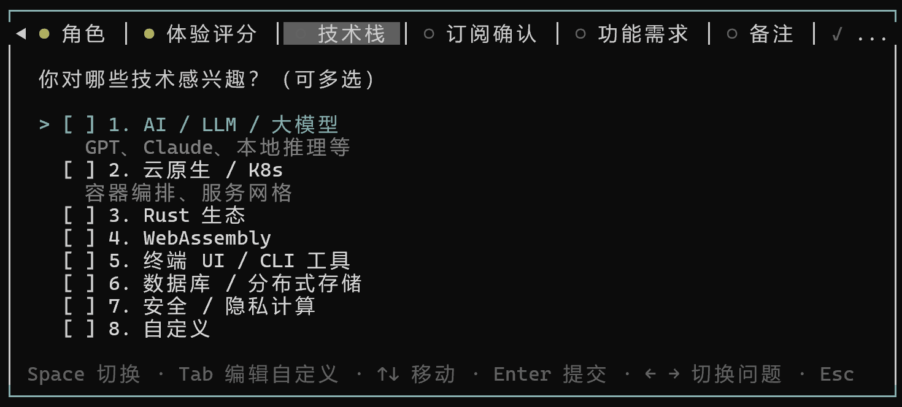
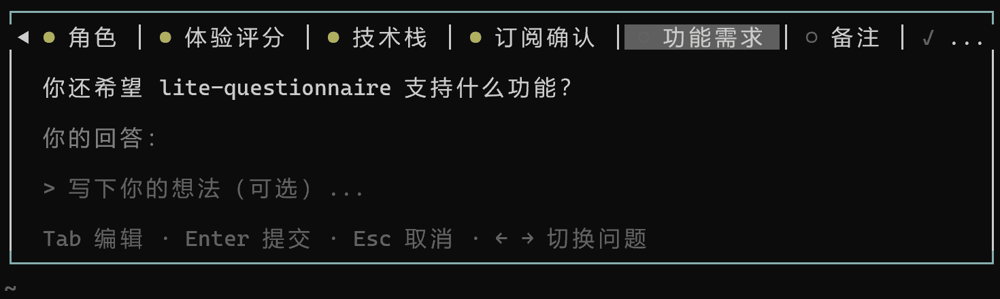
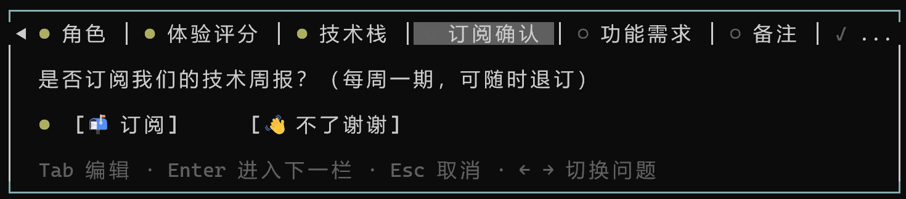
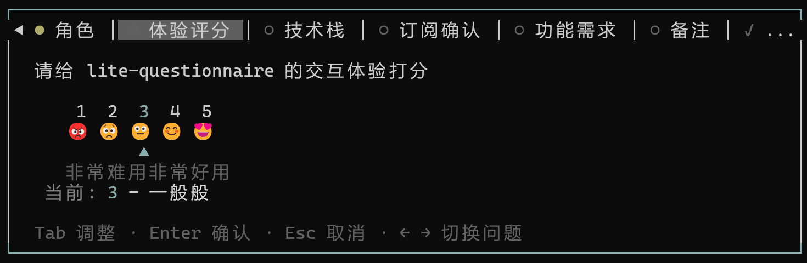

# lite-questionnaire

<p align="center">
  
</p>

通用交互式问卷工具，支持单选、多选、文本输入、确认、评分五种问题类型，提供条件子问题、约束校验、会话持久化等高级特性。

## 目录

- [参数与字段说明](#参数与字段说明)
  - [基础字段（所有类型共用）](#基础字段所有类型共用)
  - [select / multiSelect 特有字段](#select--multiselect-特有字段)
  - [text 特有字段](#text-特有字段)
  - [confirm 特有字段](#confirm-特有字段)
  - [rating 特有字段](#rating-特有字段)
- [约束条件](#约束条件)
- [条件子问题](#条件子问题)
- [交互方式与按键表](#交互方式与按键表)
- [返回结果](#返回结果)
- [会话持久化](#会话持久化)
- [完整示例](#完整示例)
- [OpenAPI 规范](#openapi-规范)
- [代码架构](#代码架构)

## 问题类型

| 类型 | 标识 | 说明 | Enter 行为 |
|------|------|------|-----------|
| `select` | 单选 | Space 标定一项，Enter 提交 | 提交并前进 |
| `multiSelect` | 多选 | Space 切换勾选多项，Enter 批量提交 | 提交并前进 |
| `text` | 文本 | 按 Tab 进入内联编辑，无选项列表 | 提交并前进 |
| `confirm` | 确认 | Y/N 双按钮，← → 切换 | 提交默认值"是"并前进 |
| `rating` | 评分 | 滑块条 + 表情量表 + 文字注释 | 提交默认值 3 并前进 |

> **注意**：所有问题均为必答。`confirm` 和 `rating` 具有默认值（是 / 3），无需进入编辑态即可直接 Enter 提交。`text` 类型留空按 Enter 会显示错误提示，不可跳过。←/→ 切换问题时自动提交当前草稿（有值则保存，无值则标红）。

## 视觉演示

### 单选



### 多选



### 文本输入



### 确认



### 评分



## 参数与字段说明

顶层参数：

| 参数 | 类型 | 说明 |
|------|------|------|
| `questions` | `Question[]` | 问题列表（至少 1 个） |

### 基础字段（所有类型共用）

| 字段 | 类型 | 必填 | 默认 | 说明 |
|------|------|------|------|------|
| `id` | string | ✅ | - | 唯一标识，作为结果映射的键名 |
| `label` | string | ✅ | - | Tab 栏短标签 |
| `prompt` | string | ✅ | - | 完整问题文本 |
| `type` | enum | ✅ | - | select / multiSelect / text / confirm / rating |
| `constraints` | Constraint[] | ❌ | [] | 声明式约束校验（详见[约束条件](#约束条件)） |
| `children` | Question[] | ❌ | [] | 条件子问题（详见[条件子问题](#条件子问题)） |
| `showIf` | { value } | ❌ | - | 子问题条件，仅 `children` 中的子问题使用 |

<a id="select--multiselect-特有字段"></a>

### select / multiSelect 特有字段

| 字段 | 类型 | 说明 |
|------|------|------|
| `options` | Option[] | 选项列表 `{ value, label, description? }` |
| `maxSelect` | number | 单选 = 1，多选 >= 2（最大可选数量） |

> 末尾自动追加"自定义"选项，Space 勾选 + Tab 编辑自定义值。

### text 特有字段

| 字段 | 类型 | 默认 | 说明 |
|------|------|------|------|
| `placeholder` | string | - | 输入框占位符 |
| `multiline` | boolean | false | 是否启用多行文本编辑 |

### confirm 特有字段

| 字段 | 类型 | 默认 | 说明 |
|------|------|------|------|
| `yesLabel` | string | "是" | 确认按钮文本 |
| `noLabel` | string | "否" | 否认按钮文本 |

> 默认选中"是"。编辑态 ←/→ 切换按钮，Enter 提交。

### rating 特有字段

| 字段 | 类型 | 默认 | 说明 |
|------|------|------|------|
| `range` | { min: 1, max: 5 } | - | 固定 1-5 评分范围 |
| `showEmoji` | boolean | false | 显示表情量表（😡😟😐😊😍） |
| `annotations` | Record&lt;string, string&gt; | - | 数值到文字注释的映射 |

> 默认值为 3。编辑态 ←/→ 或数字键调整，Enter 提交。

## 约束条件

```json
{
  "constraints": [
    { "type": "minSelect", "value": 1, "message": "至少选择一项" },
    { "type": "minLength", "value": 10, "message": "至少 10 个字符" }
  ]
}
```

| type | 适用问题 | value | 说明 |
|------|---------|-------|------|
| `required` | 全部 | - | 必填校验 |
| `minSelect` | multiSelect | number | 最少选择项数 |
| `maxSelect` | multiSelect | number | 最多选择项数 |
| `minLength` | text | number | 最小文本长度 |
| `maxLength` | text | number | 最大文本长度 |
| `pattern` | text | string | 正则匹配 |

## 条件子问题

```json
{
  "id": "lang",
  "type": "select",
  "maxSelect": 1,
  "label": "语言",
  "prompt": "用哪种编程语言？",
  "options": [
    { "value": "ts", "label": "TypeScript" },
    { "value": "py", "label": "Python" }
  ],
  "children": [
    {
      "id": "framework",
      "type": "select",
      "maxSelect": 1,
      "label": "框架",
      "prompt": "用哪个框架？",
      "showIf": { "value": "ts" },
      "options": [
        { "value": "react", "label": "React" },
        { "value": "vue", "label": "Vue" }
      ]
    }
  ]
}
```

当用户选择 "TypeScript" 时，子问题"框架"自动插入 Tab 序列中（紧跟在父问题之后）。子问题也可以嵌套自己的 `children`。

## 交互方式与按键表

| 按键 | 单选 | 多选 | 文本 | 确认 | 评分 |
|------|------|------|------|------|------|
| ↑ ↓ | 导航选项 | 导航选项 | — | — | — |
| ← → | 切换问题 | 切换问题 | 切换问题 | 切换按钮（编辑态） | 调整滑块（编辑态） |
| Space | 标定选项 | 切换勾选 | — | — | — |
| Enter | 提交+前进 | 提交+前进 | 提交+前进 | 提交+前进 | 提交+前进 |
| Tab | 编辑自定义 | 编辑自定义 | 进入编辑 | 进入编辑 | 进入编辑 |
| 1-9 | 跳转选项 | 跳转选项 | — | — | 1-5 跳到对应值 |
| Esc | 取消问卷 | 取消问卷 | 取消问卷 | 取消问卷 | 取消问卷 |

| ← → 非编辑态 | 切换 Tab，有草稿/默认值时自动保存（进度点变绿），无值时标红 |
| ← → 编辑态 | 仅操作当前控件（confirm 切换按钮，rating 调整数值），不切换问题 |

- **进度点**（三态状态机）：⚪ 未访问 → 🔴 已访问但无值 → 🟢 已完成
- **默认值**：`confirm` 默认"是"、`rating` 默认中间值，无需编辑即可直接 Enter 提交
- **←/→ 切题**：自动执行非强制提交。有有效值时保存变绿；空值离开标红；违反约束则阻止切换
- **← 回退**：随时回到上一题修改，草稿保留。修改后 Enter 覆盖原答案
- **提交页**：汇总所有答案，未完成项禁止提交，必须 ← 回去补答
- **自定义选项**：单选/多选选项列表末尾始终有"自定义"，Space 勾选 + Tab 编辑独立操作
- **单题问卷**：完成后直接返回结果（跳过提交页）

## 返回结果

提交后返回 `QuestionnaireResult`，`answers` 为键值对，键为问题 `id`，值为对应答案结构。

### 不取消时（正常提交）

```json
{
  "answers": {
    "<问题id>": { ... },
    "<问题id>": { ... }
  },
  "submittedAt": "2026-05-26T12:00:00.000Z"
}
```

### 取消时（按 Esc）

```json
{
  "cancelled": true,
  "message": "User cancelled the questionnaire"
}
```

### 答案类型

**SelectAnswer** — 单选

```json
{ "value": "ts", "label": "TypeScript", "wasCustom": false }
```

| 字段 | 类型 | 说明 |
|------|------|------|
| `value` | string | 用户选择的选项值；自定义内容时为用户输入 |
| `label` | string | 用户选择的选项显示文本 |
| `wasCustom` | boolean? | 是否来自"自定义"选项（仅自定义时为 `true`） |

**MultiSelectAnswer** — 多选

```json
{ "values": ["auth","api"], "labels": ["用户认证","REST API"], "wasCustom": false }
```

| 字段 | 类型 | 说明 |
|------|------|------|
| `values` | string[] | 用户选择的所有选项值 |
| `labels` | string[] | 用户选择的所有选项显示文本 |
| `wasCustom` | boolean? | 是否包含"自定义"选项（仅含自定义时为 `true`） |

**TextAnswer** — 文本

```json
{ "text": "一个高性能 API 服务" }
```

| 字段 | 类型 | 说明 |
|------|------|------|
| `text` | string | 用户输入的文本内容 |

**ConfirmAnswer** — 确认

```json
{ "confirmed": true, "label": "创建" }
```

| 字段 | 类型 | 说明 |
|------|------|------|
| `confirmed` | boolean | 用户的选择：`true` = 是，`false` = 否 |
| `label` | string | 用户选中的按钮文本（`yesLabel` 或 `noLabel`） |

**RatingAnswer** — 评分

```json
{ "value": 5, "annotation": "非常好" }
```

| 字段 | 类型 | 说明 |
|------|------|------|
| `value` | number | 用户选择的评分值（整数） |
| `annotation` | string | 对应数值的文字注释；未配置注解时为空字符串 |

## 会话持久化

问卷状态自动跨 TUI 会话保存与恢复。如果 AI 多次调用 `questionnaire` 工具传相同的 `questions` 列表：

- 首次调用：初始化为空白问卷
- 后续调用：恢复上一次的答案和进度，用户可继续编辑或提交
- 按 Esc 取消后：下次调用仍恢复之前的草稿（取消不会丢失数据）
- 提交后：下一次相同 `questions` 的调用将重新开始（清空状态）

对 AI 而言无需特殊处理，正常调用 `questionnaire` 即可享受无缝续填体验。

## 完整示例

```json
{
  "questions": [
    {
      "id": "lang",
      "type": "select",
      "maxSelect": 1,
      "label": "语言",
      "prompt": "用哪种编程语言？",
      "options": [
        { "value": "ts", "label": "TypeScript" },
        { "value": "py", "label": "Python" },
        { "value": "rs", "label": "Rust" }
      ],
      "children": [
        {
          "id": "framework",
          "type": "select",
          "maxSelect": 1,
          "label": "框架",
          "prompt": "用哪个框架？",
          "showIf": { "value": "ts" },
          "options": [
            { "value": "react", "label": "React" },
            { "value": "vue", "label": "Vue" }
          ]
        }
      ]
    },
    {
      "id": "features",
      "type": "multiSelect",
      "maxSelect": 3,
      "label": "功能",
      "prompt": "需要哪些功能？",
      "options": [
        { "value": "auth", "label": "用户认证" },
        { "value": "api", "label": "REST API" },
        { "value": "ws", "label": "WebSocket" }
      ],
      "constraints": [
        { "type": "minSelect", "value": 1, "message": "至少选择一项" }
      ]
    },
    {
      "id": "description",
      "type": "text",
      "label": "描述",
      "prompt": "项目描述",
      "multiline": true
    },
    {
      "id": "confirm",
      "type": "confirm",
      "label": "确认",
      "prompt": "确定要创建项目？",
      "yesLabel": "创建",
      "noLabel": "取消"
    },
    {
      "id": "satisfaction",
      "type": "rating",
      "label": "满意度",
      "prompt": "对代码质量的满意度？",
      "range": { "min": 1, "max": 5 },
      "showEmoji": true,
      "annotations": { "1": "非常差", "5": "非常好" }
    }
  ]
}
```

## OpenAPI 规范

完整的 OpenAPI 3.0 类型定义见 [`design/questionnaire-openapi.yaml`](design/questionnaire-openapi.yaml)。包含所有 schema 定义、答案类型、约束类型和完整请求示例。

## 代码架构

```
lite-questionnaire/
├── index.ts            # 入口，注册工具 + TypeBox Schema + 渲染回调
├── core.ts             # 状态管理、子问题展开、状态机进度判定、约束校验
├── types.ts            # TypeScript 类型定义
├── render.ts           # 通用渲染（面板框架、Tab 栏、提交页、提示栏）
├── input.ts            # 全局按键分发（← → Space Enter Esc Tab 1-9）
├── state.ts            # 会话持久化（pi.appendEntry）
├── modules/
│   ├── shared.ts       # 模块间共享类型
│   ├── select.ts       # 单选渲染 + 输入处理
│   ├── multiSelect.ts  # 多选渲染 + 输入处理
│   ├── text.ts         # 文本编辑渲染 + 草稿保存
│   ├── confirm.ts      # 确认双按钮渲染
│   └── rating.ts       # 评分滑块 + 表情渲染
├── design/
│   └── questionnaire-openapi.yaml
├── image/
├── skills/
│   └── lite-questionnaire/
│       └── SKILL.md
├── .gitignore
├── LICENSE
├── package.json
└── README.md
```
